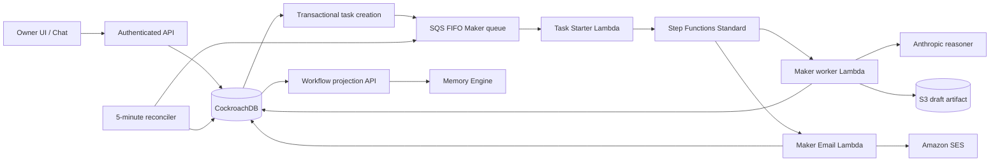
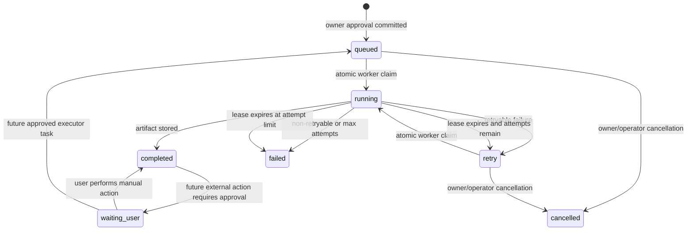

# Brass Tacks Multi-Tenant Agent Task Platform

**Status:** production-shaped foundation implemented in this repository; external account publishing remains a controlled roadmap item.

**Audience:** product, engineering, operations, security, and hackathon judges.

**Purpose:** define how Brass Tacks runs many agent tasks for many business owners without mixing tenants, losing work, creating duplicate drafts, overspending model tokens, or hiding what each agent is doing.

---

## 1. Executive summary

Brass Tacks now separates **agent intelligence** from **task execution**.

The language model may decide what content should be created. It does **not** decide which tenant owns the task, whether an owner approved it, whether a duplicate may run, which account credential may be used, or whether an irreversible external action is allowed. Those responsibilities belong to a deterministic task control plane.

The implemented path is:

```text
Owner presses Do it or uses Undo Pass
        ↓
CockroachDB commits one idempotent work_task
        ↓
SQS FIFO buffers the dispatch
        ↓
Step Functions Standard starts one durable workflow attempt
        ↓
Maker atomically claims the task in CockroachDB
        ↓
Maker creates one owner-ready draft
        ↓
Draft is stored in S3 + CockroachDB
        ↓
A constrained SES tool emails the review link
        ↓
Memory Engine shows the exact task, events, artifact, and tool receipt
```

This design permits many businesses to run unrelated tasks in parallel while preventing the same recommendation from being generated twice.

### What is implemented now

The task schema is generic, but the first production path attached to it is the
Maker draft workflow. Radar, Analyst, Ask and Meter continue to use their existing
scheduled/request paths until they are migrated one task type at a time.

- Tenant-scoped durable `work_task` rows in CockroachDB.
- Immutable task-event receipts and idempotent tool-execution receipts.
- SQS FIFO buffering, per-resource ordering, deduplication IDs, and a dead-letter queue.
- Step Functions **Standard** workflow for one Maker task.
- Atomic worker claims with leases and bounded retries.
- One current draft artifact per task idempotency key.
- SQL-only reconciliation of missed queue events and expired claims.
- Immediate Do it / Pass feedback in the owner UI.
- Exact task-level Maker visibility in Memory Engine.
- A constrained Amazon SES review-email tool targeting the configured owner/test inbox, currently `virtual.icfd@gmail.com` by default.
- A signed-in task deep link that opens the exact recommendation and full draft.
- Full auditability without sending the complete memory corpus to the model.

### What is deliberately not implemented yet

- Logging into Google, Yelp, Meta, a POS, or another third-party site.
- Collecting or exposing an owner's password to a model.
- OAuth connection storage and delegated publishing.
- Browser automation for sites without an API.
- Automatic posting to public channels.
- Amazon Bedrock AgentCore as a runtime dependency.

Those capabilities are described as the next controlled phases in this document. They require provider applications, OAuth scopes, credential-vault configuration, policy review, and approval UX. They should not be simulated as complete.

---

## 2. Design principles

### 2.1 CockroachDB is the source of truth

SQS and Step Functions deliver and orchestrate work. They are not the authoritative task ledger. The current status, owner, approval, claim, artifact, tool receipt, and error remain in CockroachDB.

This means a lost queue message can be recovered, a duplicate message is harmless, and the UI can explain what happened after the original Lambda process no longer exists.

### 2.2 At-least-once delivery, idempotent effects

SQS-triggered Lambda delivery can occur more than once. Step Functions retries can invoke a task state again. Network timeouts can occur after an external service accepted an action but before Brass Tacks wrote the receipt.

Therefore Brass Tacks does **not** claim magical end-to-end exactly-once delivery. Instead it implements:

1. One durable task idempotency key.
2. One deterministic workflow execution name per dispatch attempt.
3. One atomic CockroachDB claim token per worker attempt.
4. One artifact idempotency key per task and artifact version.
5. One tool-execution idempotency key per task and tool version.

The result is effectively-once business behavior for supported tools, provided the external service offers either an idempotency key or a verifiable receipt. When an external service does not offer caller-supplied idempotency, Brass Tacks records an in-doubt running receipt rather than guessing and repeating the action.

### 2.3 Tenant identity is never accepted from the browser as authority

The backend derives `business_id` from the authenticated owner session. A request parameter cannot select another tenant. Every task, event, artifact, and tool receipt carries the business ID and is queried through that tenant boundary.

### 2.4 Approval is a state transition, not prompt text

An owner approval is written to CockroachDB before a Maker task is created. The model never infers approval from conversational tone for irreversible actions.

Undo Pass is a deterministic status transition from rejected to accepted. Once a task proceeds into external execution, later reversal requires a separate cancellation or compensating action rather than rewriting history.

### 2.5 Models create; deterministic tools execute

Maker creates a deliverable. An Executor/tool performs a constrained side effect. The model is never handed unrestricted SDK credentials or arbitrary API access.

### 2.6 The operator can always answer “what is happening?”

For every task, Memory Engine should reveal:

- Which business owns it.
- Which recommendation or owner request created it.
- Who approved it and when.
- Which agent owns the current step.
- Whether it is waiting, running, ready, failed, or complete.
- Which workflow attempt is active.
- What artifact was created.
- Which external tool ran.
- What receipt or external reference was returned.
- How many model tokens were used.

---

## 3. Current architecture



### Component responsibilities

| Component | Responsibility | Must not do |
|---|---|---|
| Decision / Ask API | Authenticate the owner, commit approval, create or reuse the task, enqueue one dispatch | Generate the draft synchronously or accept a browser-supplied tenant |
| CockroachDB | Authoritative task ledger, atomic claim, artifacts, events, tool receipts, tenant boundary | Depend on a Lambda process remaining alive |
| SQS FIFO | Buffer bursts, preserve ordering for conflicting resources, deduplicate one dispatch attempt, hold failures in a DLQ | Decide whether a task is valid or complete |
| Task Starter | Convert one queue message into one named Step Functions execution | Perform Maker work |
| Step Functions Standard | Durable orchestration, retry envelope, task-level execution history | Store business truth instead of CockroachDB |
| Maker worker | Atomically claim one task, retrieve bounded context, generate one draft, complete or retry the task | Publish externally or choose credentials |
| SES tool | Send a completed draft to one configured review inbox and record the SES receipt | Choose arbitrary recipients from model output |
| Reconciler | Recover missed dispatches, old accepted recommendations, and expired worker leases using SQL | Invoke a model when no work exists |
| Memory Engine | Show portfolio and per-task status from the live task ledger | Invent task progress from UI state |

---

## 4. Durable task model

### 4.1 `work_task`

One row represents one unit of owner-approved work.

Important fields:

| Field | Meaning |
|---|---|
| `id` | Stable task identifier and deep-link target |
| `business_id` | Tenant owner; required on every task |
| `find_id` | Recommendation that created the task, when applicable |
| `requested_by_account_id` | Authenticated account that requested the work |
| `agent` | Current specialist, initially `maker` |
| `task_type` | Versioned capability such as `maker.generate_draft` |
| `status` | `queued`, `running`, `waiting_user`, `completed`, `retry`, `failed`, or `cancelled` |
| `priority` | Lower number dispatches first |
| `idempotency_key` | Unique business operation key |
| `resource_key` | FIFO ordering key for conflicting tasks |
| `approval_state` | Deterministic approval gate |
| `attempt_count` | Worker claims, not browser clicks |
| `dispatch_count` | Queue/workflow attempts |
| `claim_token` | Random token required to complete or fail a claimed task |
| `lease_expires_at` | Recovery boundary if a worker disappears |
| `workflow_execution_arn` | Exact Step Functions receipt |
| `output_artifact_id` | Current completed output |
| `input_data` / `output_data` | Compact structured task context and result receipt |
| timestamps | Created, approved, started, updated, completed, next retry |

### 4.2 `task_event`

Append-only operational history. Examples:

```text
task.created
queue.sent
task.dispatched
workflow.started
task.claimed
task.completed
task.retry_scheduled
task.failed
task.lease_expired
tool.started
tool.succeeded
tool.failed
```

Events make the workflow explainable without reconstructing it from logs.

### 4.3 `tool_execution`

One idempotent external-tool receipt.

Important fields:

- `task_id` and `business_id`
- `tool_name`
- unique `idempotency_key`
- `running`, `succeeded`, `failed`, `skipped`, or `cancelled`
- compact input and output metadata
- external reference such as an SES message ID
- error and timestamps

The model does not receive credentials or raw recipient lists. Tool configuration is resolved by trusted backend code.

### 4.4 Artifact linkage

Artifacts now include:

- `task_id`
- unique `idempotency_key`
- full `body`
- S3 location
- short preview

One current artifact is created for one task/version. The full body is available to the signed-in owner, while the operator view can display a compact preview.

---

## 5. Task state machine



The current Maker draft flow ends at `completed` after the draft is stored. The email notification is a separate idempotent tool receipt and does not change a successful draft into a failure if notification is disabled or unavailable.

---

## 6. Multi-user scale and fairness

### 6.1 Parallelism without global serialization

The previous single-Maker design risked either duplicate work or a global concurrency limit of one. The new design permits parallel tasks and protects only resources that can conflict.

Current Maker draft resource key:

```text
maker:find:{business_id}:{find_id}
```

Different recommendations can run in parallel—even for the same business—because draft generation does not mutate one shared external account.

Future tool resource keys should serialize only the shared destination:

```text
google-profile:{connection_id}
email-account:{connection_id}
website:{business_id}
pos-catalog:{connection_id}
calendar:{connection_id}
```

### 6.2 Queue fairness

The SQL reconciler limits the number of dispatchable tasks selected per business. This prevents an older high-volume tenant from monopolizing reconciliation.

Current foundation:

- FIFO queue for Maker work.
- One message group per conflicting resource.
- Per-business reconciliation selection limit.
- Global bounded reconciliation batch.

Next production hardening:

- Configurable per-plan concurrency quotas.
- Priority tiers with separate queues where justified.
- Explicit semaphore rows for scarce external accounts or browser sessions.
- CloudWatch alarms on oldest-task age, DLQ depth, and tenant starvation.

### 6.3 Backpressure

SQS absorbs temporary bursts. Lambda and Step Functions scale behind the queue. If a downstream provider throttles, the task remains durable and retryable instead of blocking the owner's HTTP request.

---

## 7. Agent responsibilities

### Ask / Concierge

- Understand the owner's question.
- Retrieve a bounded recent/semantic conversation context.
- Query live business memory where needed.
- Convert explicit owner intent into a structured task or decision.
- Never perform an irreversible external action based only on ambiguous language.

### Analyst

- Combine market observations, owner profile, owner rules, conversation memory, and prior outcomes.
- Produce a concise, evidence-backed, measurable growth opportunity.
- Store the recommendation and evidence before presenting it.
- Optimize for the highest-value executable move, not the longest explanation.

### Maker

- Retrieve the approved task and bounded owner context.
- Create the exact deliverable promised by the recommendation.
- Store one current draft and token receipt.
- Never publish or log into an external account directly.

### Executor / tool layer

- Validate approval, tenant, connection, scope, idempotency, and policy.
- Perform a deterministic external side effect.
- Store an external receipt.
- Return a structured result to the workflow.

The first implemented Executor tool is `ses.send_review_email`.

### Meter

- Confirm whether execution occurred.
- Measure the business result against the original prediction.
- Preserve wins, estimates, and misses.
- Feed learned outcomes back into future Analyst retrieval.

---

## 8. First visible execution tool: SES review email

### 8.1 Current test scenario

After Maker completes a draft, the workflow can email it to:

```text
virtual.icfd@gmail.com
```

The recipient is configuration, not model output.

The email includes:

- Draft title.
- Complete draft body.
- Stable task receipt ID.
- Link to `/app/?task=<task_id>`.

After sign-in, the app opens the exact recommendation and Maker review panel. The owner can read and copy the full draft for manual posting.

### 8.2 Safety properties

- Email is disabled by default.
- Sender and recipient are loaded from SSM/environment configuration.
- The tool cannot send to an arbitrary address supplied by a prompt.
- One unique tool-execution key protects each task/version.
- SES message ID is stored as the external receipt.
- If a previous SES call is still in doubt, Brass Tacks does not automatically resend and risk a duplicate email.

### 8.3 Configuration

Required values under the configured SSM prefix:

```text
MAKER_EMAIL_ENABLED=true
MAKER_EMAIL_FROM=<verified SES sender>
MAKER_REVIEW_EMAIL=virtual.icfd@gmail.com
```

The site URL is injected into the Maker Email Lambda by CloudFormation.

In the SES sandbox, AWS requires verified identities for sending, and recipient verification is also required unless the account is moved out of the sandbox. Verify the selected sender and, for a sandbox test, `virtual.icfd@gmail.com` in `us-east-1` before enabling the tool.

### 8.4 Manual-post workflow

```text
Draft ready
    ↓
Review email delivered
    ↓
Owner opens task link
    ↓
Owner copies approved content
    ↓
Owner posts it manually
    ↓
Future “Mark as posted” receipt
    ↓
Meter begins measurement
```

The first implementation proves that Maker completed a visible external task and provides a durable receipt. It does not claim that a public post occurred.

---

## 9. Future account connection and delegated publishing

### 9.1 Preferred route: provider API + OAuth

For supported services, the owner should sign in directly with the provider and grant a narrow OAuth scope.

```text
Owner chooses Connect account
        ↓
Provider authorization page
        ↓
Owner authenticates directly with provider
        ↓
Provider returns authorization code
        ↓
Token is stored in a credential vault
        ↓
Brass Tacks stores only connection metadata
        ↓
Maker prepares exact proposed action
        ↓
Owner approves exact content and destination
        ↓
Executor publishes through a constrained tool
        ↓
Receipt is stored and Meter begins
```

The model must never receive a password, access token, refresh token, client secret, or unrestricted SDK session.

### 9.2 AgentCore roadmap

Amazon Bedrock AgentCore is a strong future fit, but it is **not required by the current implementation**.

Potential mapping:

| AgentCore capability | Future Brass Tacks use |
|---|---|
| Runtime | Isolated, horizontally scalable specialist-agent sessions |
| Gateway | Governed MCP-compatible tool registry and API targets |
| Identity | User-delegated OAuth and secure token access |
| Browser | Isolated fallback automation for sites with no reliable API |
| Observability | Session/tool traces, latency, errors, and token metrics |
| Evaluations | Automated task-completion and tool-selection scoring |

Adoption should happen after the CockroachDB task contract and approval model remain stable. The task ledger should continue to be authoritative even if the runtime changes.

### 9.3 Browser fallback

Browser automation is a last resort for services without a supported API.

Required controls:

- Isolated browser session per tenant/task.
- User signs in personally; no password passes through the model.
- Persist only protected browser-profile state in an approved vault.
- Live-view and takeover before sensitive final actions.
- Exact content preview and explicit final approval.
- Session recording or auditable action receipt.
- Resource key serializes one browser/account connection.
- Immediate revocation and connection-management UI.

---

## 10. Tool extension contract

Every new execution tool should implement the same contract.

### Required inputs

- Authenticated `business_id`.
- Stable `task_id`.
- Approved structured payload.
- Fixed or server-resolved `connection_id`.
- Versioned `idempotency_key`.

### Required validation

1. Task belongs to the authenticated tenant.
2. Task is in the expected state.
3. Required approval is recorded.
4. Connection has the exact required scope.
5. Destination is allowed by policy.
6. Payload matches a strict schema.
7. Tool execution has not already succeeded.
8. Rate and tenant quotas permit execution.

### Required output

```json
{
  "status": "succeeded",
  "tool_name": "provider.action",
  "external_reference": "provider-receipt-id",
  "completed_at": "...",
  "safe_summary": "..."
}
```

### Required failure behavior

- Retry only errors classified as transient.
- Never retry an in-doubt non-idempotent side effect automatically.
- Store a redacted error receipt.
- Send exhausted work to a DLQ/operator queue.
- Do not expose credentials in logs, task events, prompts, or UI.

---

## 11. Token-efficient memory strategy

The task platform should not make every operational refresh or duplicate delivery invoke a model.

### Zero-token paths

- Workflow status refresh is SQL only.
- Empty reconciliation sweep is SQL only.
- Duplicate queue delivery that fails the atomic claim exits before model construction.
- Repeated Do it reuses the existing task.
- Repeated tool execution reuses its receipt.
- Task/event rendering requires no LLM.

### Bounded model context

Maker should receive only:

- Approved recommendation and requested deliverable.
- Relevant business facts and owner rules.
- A small number of semantically relevant owner messages.
- Relevant prior successful artifacts where useful.
- Required evidence—not the complete observation corpus.

Each agent run stores provider-reported input/output tokens and links them to its task or recommendation receipt.

---

## 12. Observability and operator controls

### Required metrics

- Queue depth and age of oldest message.
- DLQ depth.
- Tasks by status and agent.
- Claim latency and lease expirations.
- Attempts per task.
- Workflow failures and duration.
- Model input/output tokens per task and tenant.
- Tool success/failure/in-doubt counts.
- External provider latency and throttling.
- Duplicate delivery avoided.
- Time from owner approval to draft ready.
- Time from draft ready to owner action.

### Required alarms

- Any DLQ message.
- Oldest queued task above service objective.
- Repeated lease expiration.
- Tool failure-rate spike.
- SES bounce/complaint threshold when real email is enabled.
- Token or cost anomaly by tenant.
- One tenant consuming an abnormal share of capacity.

### Operator actions

Future operator controls should include:

- Retry a safe failed task.
- Cancel queued/retry work.
- Resolve an in-doubt tool execution.
- Re-send a review notification only with explicit confirmation.
- View redacted task events and provider receipt.
- Disable a compromised external connection.
- Quarantine one tenant without stopping others.

---

## 13. Security boundaries

- Never commit AWS, CockroachDB, Anthropic, provider, or OAuth credentials.
- Use SSM Parameter Store/Secrets Manager or a dedicated credential vault.
- Rotate any key ever committed to Git history.
- Use temporary AWS credentials/OIDC for CI/CD when possible.
- Keep API authentication and tenant authorization server-side.
- Redact task errors before returning them to the public UI.
- Separate owner artifacts from the public website bucket.
- Limit every external connector to the minimum OAuth scopes.
- Require explicit approval for public, financial, destructive, or customer-contacting actions.
- Keep the LLM outside the credential boundary.
- Record who approved an action, what exact content was approved, and which version executed.

---

## 14. Deployment and migration

### 14.1 Apply schema first

The repository includes an additive runtime safety bootstrap, but production deployment should explicitly apply the schema before shifting traffic:

```bash
python db/migrate.py --schema-only
```

The migration adds:

- `work_task`
- `task_event`
- `tool_execution`
- task/idempotency/body columns on `artifact`

### 14.2 Deploy infrastructure

```bash
sam build --template deploy/template.yaml
sam deploy \
  --template .aws-sam/build/template.yaml \
  --stack-name brasstacks \
  --region us-east-1 \
  --capabilities CAPABILITY_IAM \
  --resolve-image-repos \
  --resolve-s3 \
  --no-confirm-changeset \
  --no-fail-on-empty-changeset \
  --parameter-overrides ArtifactBucket=<existing-artifact-bucket>
```

New infrastructure includes:

- Maker FIFO queue and DLQ.
- Task Starter Lambda.
- Maker worker Lambda.
- Maker Email Lambda.
- Step Functions Standard workflow.
- SQL-only reconciliation schedule.

### 14.3 Configure SES review email

```bash
aws ssm put-parameter --type String --overwrite \
  --name /brasstacks/MAKER_EMAIL_ENABLED --value true

aws ssm put-parameter --type String --overwrite \
  --name /brasstacks/MAKER_EMAIL_FROM --value '<verified-sender@example.com>'

aws ssm put-parameter --type String --overwrite \
  --name /brasstacks/MAKER_REVIEW_EMAIL --value 'virtual.icfd@gmail.com'
```

After changing a parameter, force a cold start or redeploy because warm Lambda environments cache the SSM values.

---

## 15. Test plan

### Unit and contract tests

```bash
python -m pytest backend/tests -q
```

Coverage includes:

- Repeated owner approval creates one task.
- FIFO dispatch uses a deterministic deduplication ID.
- Duplicate queue delivery starts no duplicate workflow.
- Only one worker can claim a task.
- Duplicate workers construct no second reasoner.
- Artifact creation is idempotent.
- Retry and stale-lease recovery.
- Per-business dispatch fairness.
- SES disabled/missing/success/failure/in-doubt receipts.
- Workflow projection includes bounded events and full owner draft.
- Task deep link opens the exact recommendation and draft.
- Immediate UI feedback and exact Maker activity rows.

### Live acceptance test

1. Deploy the full stack successfully.
2. Verify SES sender and test recipient.
3. Sign in as a business owner.
4. Press Do it on one recommendation.
5. Confirm the card immediately shows Saving, then Approved/Maker queued.
6. Confirm one `work_task` appears—not two.
7. Confirm Memory Engine shows the exact current task and step.
8. Confirm one draft artifact is created.
9. Confirm one email reaches `virtual.icfd@gmail.com`.
10. Open the email link and sign in.
11. Confirm the exact task and full draft open.
12. Refresh/reopen and verify state persists.
13. Wait for reconciliation and verify it creates no duplicate draft/email.
14. Inspect the SES message ID and task/tool receipts.

### Failure tests

- Disable email: draft succeeds, notification records `skipped`.
- Invalid SES sender: draft remains complete, tool records failure.
- Duplicate queue message: one task and one artifact.
- Worker crash: lease expires and reconciler retries.
- Queue send failure: task remains queued and reconciler recovers it.
- External action in doubt: do not automatically repeat.

---

## 16. Rollout roadmap

### Phase 1 — implemented foundation

- Durable task ledger.
- SQS FIFO + DLQ.
- Step Functions Standard.
- Atomic Maker worker.
- Task-level UI and receipts.
- SES review email to the configured owner/test inbox.

### Phase 2 — manual execution receipts

- “Copy draft” and “Open destination.”
- “Mark as posted” with user/time receipt.
- Optional screenshot or URL proof.
- Meter handoff after user completion.

### Phase 3 — OAuth connections

- Connection-management page.
- Provider authorization-code flow.
- Secure token vault.
- Per-connection scopes and resource keys.
- Exact final-action approval.

### Phase 4 — API execution tools

Recommended order:

1. Email campaign preview/test send.
2. Google Business post.
3. Review response.
4. Staff task/checklist.
5. Scheduling/calendar.
6. Vertical-specific POS/e-commerce actions.

### Phase 5 — browser fallback

- Isolated browser profile.
- Live owner takeover for sign-in.
- Approval before final action.
- Recording/receipt and strict per-account concurrency.

### Phase 6 — AgentCore evaluation

- Evaluate Runtime, Gateway, Identity, Browser, Observability, and Evaluations.
- Keep CockroachDB task semantics and idempotency contract unchanged.
- Migrate one specialist/tool at a time.

---

## 17. Definition of “production-ready” for a new tool

A new Maker capability is not production-ready merely because the model can call it once. It is ready only when all of these are true:

```text
[ ] Tenant is derived from authentication
[ ] Explicit approval policy is enforced
[ ] Payload schema is strict
[ ] Idempotency key is defined
[ ] Conflicting-resource key is defined
[ ] Retry classes are defined
[ ] In-doubt behavior is defined
[ ] Tool receipt is persisted
[ ] Credentials never enter the prompt
[ ] Rate and tenant limits exist
[ ] Operator can see current status
[ ] Owner can see exact proposed/executed content
[ ] Failure and DLQ alarms exist
[ ] Meter knows how to verify the outcome
[ ] Unit, duplicate, retry, and live tests pass
```

---

## 18. Official references

- AWS Step Functions workflow types: <https://docs.aws.amazon.com/step-functions/latest/dg/choosing-workflow-type.html>
- AWS Lambda with Amazon SQS: <https://docs.aws.amazon.com/lambda/latest/dg/with-sqs.html>
- Partial batch responses for SQS: <https://docs.aws.amazon.com/lambda/latest/dg/services-sqs-errorhandling.html>
- Amazon SES identity verification: <https://docs.aws.amazon.com/ses/latest/dg/creating-identities.html>
- Amazon SES sandbox: <https://docs.aws.amazon.com/ses/latest/dg/request-production-access.html>
- Amazon Bedrock AgentCore overview: <https://docs.aws.amazon.com/bedrock-agentcore/latest/devguide/what-is-bedrock-agentcore.html>
- AgentCore Gateway: <https://docs.aws.amazon.com/bedrock-agentcore/latest/devguide/gateway.html>
- AgentCore Identity: <https://docs.aws.amazon.com/bedrock-agentcore/latest/devguide/identity.html>
- AgentCore Browser: <https://docs.aws.amazon.com/bedrock-agentcore/latest/devguide/browser-tool.html>
- AgentCore Observability: <https://docs.aws.amazon.com/bedrock-agentcore/latest/devguide/observability.html>

---

## 19. Architecture decision

Brass Tacks will use:

> **CockroachDB as the authoritative multi-tenant task and memory ledger; SQS FIFO as the buffered delivery layer; Step Functions Standard as the durable orchestration layer; specialist Lambdas as horizontally scalable workers; and a constrained, approval-gated tool registry for external actions.**

AgentCore is the preferred future platform for delegated identity, governed tools, browser fallback, and advanced agent observability—but it will be introduced without weakening the CockroachDB task contract or the owner's approval boundary.
